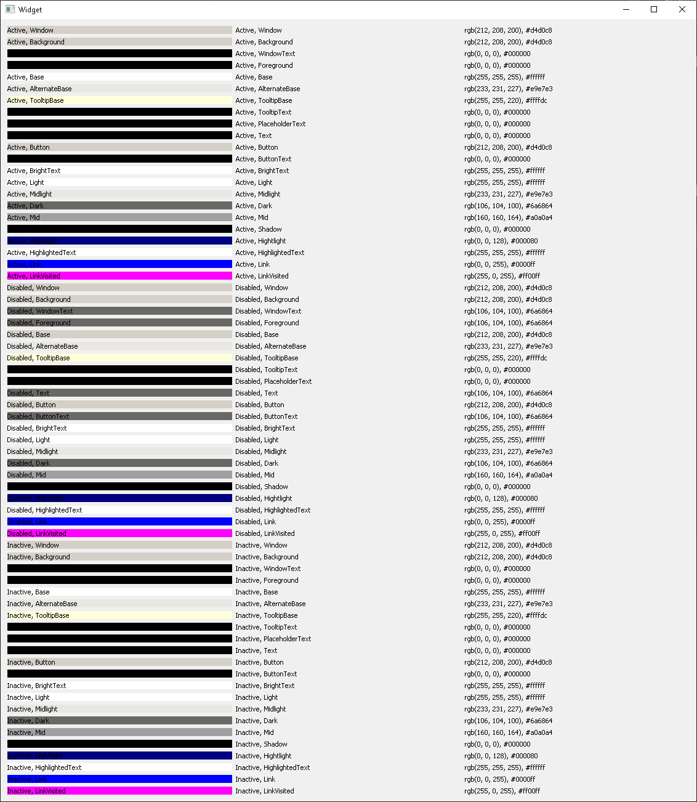

# qt-palette-colors
A simple Qt application to visually display the various QPalette color group and role color combinations.

<p align="center"></p>

### Building with QMake

```
$ git clone https://github.com/ensisoft/qt-palette-colors
$ qmake
$ make
$ ./qt-palette-colors
```


### Building with CMake (Windows)

```
$ git clone https://github.com/ensisoft/qt-palette-colors
$ cd qt-palette-colors
$ mkdir build
$ cd build
$ cmake -G "Visual Studio 16 2019" .. -DCMAKE_BUILD_TYPE=Release
$ cmake --build . --config Release
$ Release\Test.exe
```

